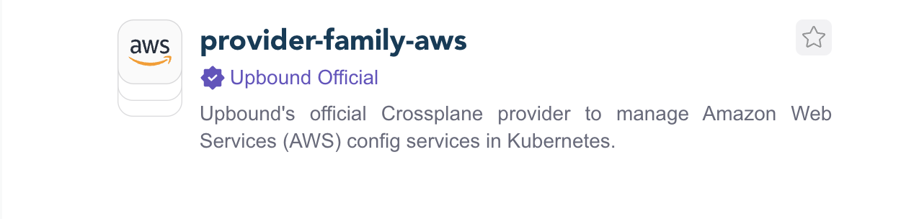
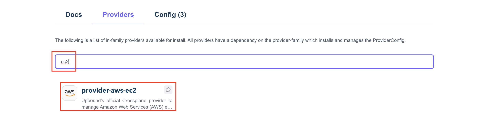
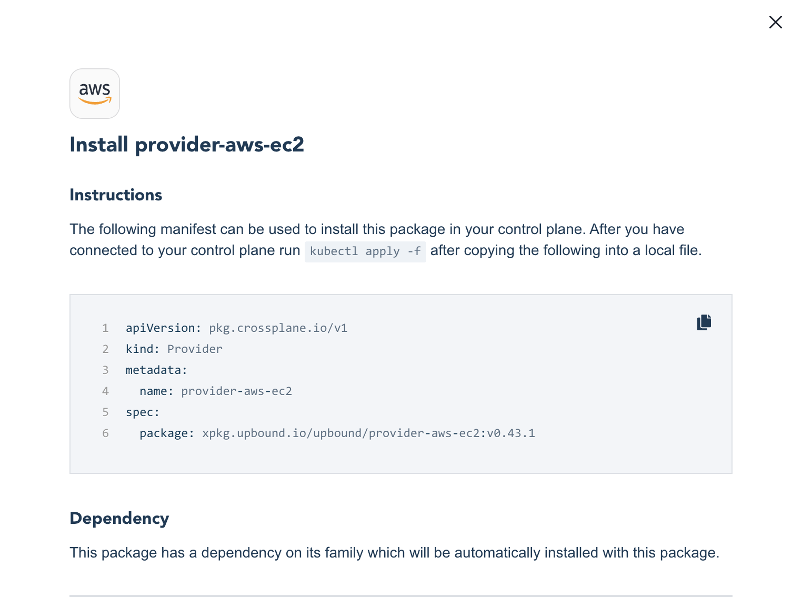

### **Lab 03 [AWS]: Installing Official Providers**

[Providers](https://marketplace.upbound.io/providers) extend Crossplane to enable infrastructure resource provisioning. In this lab, we will extend Crossplane to provision infrastructure on AWS by deploying the [Official AWS provider by Upbound](https://marketplace.upbound.io/providers/upbound/provider-family-aws/latest).

**Prerequisites:**

- Ensure that you have completed [Lab 02](../../lab02/lab02.md), or you have a running UXP instance.

**Steps:**

1. Go to [Upbound Marketplace](https://marketplace.upbound.io) and search for “provider-family-aws”


2. There are several providers. Look for the provider with the OFFICIAL Label, which is supported by Upbound and click on it.



3. You should have more details about the package, including a link to the newest version and a dropdown to select versions.


4. To obtain an Installation Manifest, select the most recent version and search for the service-scoped provider. Next, click on the “Install Manifest” button, and a window will appear:





Copy the official AWS provider installation manifest to your system, create a file provider-aws-ec2.yaml with the copied contents. The main difference will be the version, as a new release of provider-aws comes out weekly.

Below is the manifest to install the service scoped provider. Note that only the ec2 controller and CRDs will be installed:

```
# Family scoped provider for AWS EC2
# copy the contents into a file called provider-aws-ec2.yaml

apiVersion: pkg.crossplane.io/v1
kind: Provider
metadata:
  name: provider-aws-ec2
spec:
  package: xpkg.upbound.io/upbound/provider-aws-ec2:v0.43.1
```

5. Install the official AWS provider using the file that you created in step 4:

```
$ kubectl apply -f provider-aws-ec2.yaml
provider.pkg.crossplane.io/provider-aws-ec2 created
```

6. Verify that the provider package is **_INSTALLED_** and **_HEALTHY:_**

```
$ kubectl get -f provider-aws-ec2.yaml
NAME               INSTALLED   HEALTHY   PACKAGE                                            AGE
provider-aws-ec2   True        True      xpkg.upbound.io/upbound/provider-aws-ec2:v0.43.1   43s
```

7. You can also verify installation using the provider.pkg CRD. Note that in the family scoped providers, a common package called provider-family-aws is automatically brought in as a prerequisite. This provider contains the ProviderConfig that is shared among all the scoped providers.

```
$  kubectl get provider.pkg
NAME                          INSTALLED   HEALTHY   PACKAGE                                               AGE
provider-aws-ec2              True        True      xpkg.upbound.io/upbound/provider-aws-ec2:v0.43.1      73s
upbound-provider-family-aws   True        True      xpkg.upbound.io/upbound/provider-family-aws:v0.43.1   56s
```

8. Verify that the provider CRDs are defined on the cluster. Note that only CRDs from the EC2 group have been installed.

With scoped providers, you’ll need to install a package for each of the groupings of AWS services you intend to use (Lambda, RDS, IAM, etc.)

```
$ kubectl get crd | grep aws.upbound.io

amicopies.ec2.aws.upbound.io                                   2023-11-04T12:11:08Z
amilaunchpermissions.ec2.aws.upbound.io                        2023-11-04T12:11:08Z
amis.ec2.aws.upbound.io                                        2023-11-04T12:11:08Z
availabilityzonegroups.ec2.aws.upbound.io                      2023-11-04T12:11:08Z
capacityreservations.ec2.aws.upbound.io                        2023-11-04T12:11:08Z
carriergateways.ec2.aws.upbound.io                             2023-11-04T12:11:08Z
customergateways.ec2.aws.upbound.io                            2023-11-04T12:11:08Z
defaultnetworkacls.ec2.aws.upbound.io                          2023-11-04T12:11:08Z
defaultroutetables.ec2.aws.upbound.io                          2023-11-04T12:11:08Z
defaultsecuritygroups.ec2.aws.upbound.io                       2023-11-04T12:11:08Z
defaultsubnets.ec2.aws.upbound.io                              2023-11-04T12:11:08Z
...
...
...
vpngatewayattachments.ec2.aws.upbound.io                       2023-11-04T12:11:10Z
vpngatewayroutepropagations.ec2.aws.upbound.io                 2023-11-04T12:11:10Z
vpngateways.ec2.aws.upbound.io                                 2023-11-04T12:11:10Z
```

9. Verify that the controller pod for provider-aws is **_Running_** and **_Ready_**:

```
$ kubectl -n upbound-system get pods | grep provider-aws-ec2

provider-aws-ec2-4805a8dbe18c-6b6486b95f-pdlc6              1/1     Running   0          2m56s
```

**Lab 03 Complete.** 

- Continue to [Lab 04](../../lab04/aws/lab04.md).
