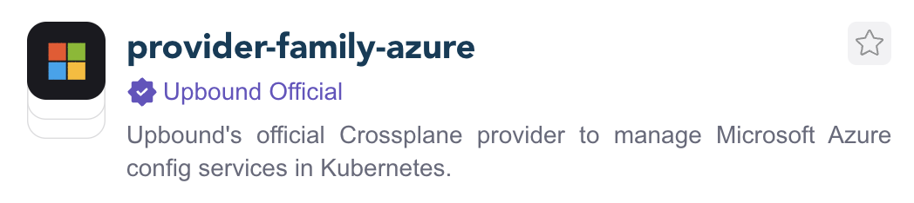
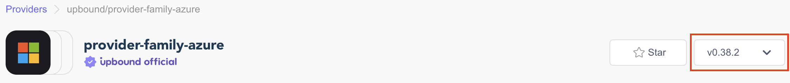
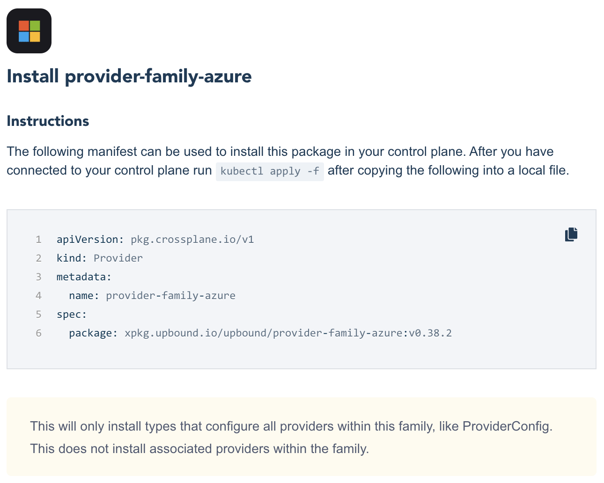

### **Lab 03 [Azure]: Installing Official Family Providers**

[Providers](https://marketplace.upbound.io/providers) extend Crossplane to enable infrastructure resource provisioning. In this lab, we will extend Crossplane to provision infrastructure on Azure by deploying the [Official Azure provider by Upbound](https://marketplace.upbound.io/providers/upbound/provider-family-azure/latest).

**Prerequisites:**

- Ensure that you have completed [Lab 02](../../lab02/lab02.md) or you have a running UXP instance.

**Steps:**

1. Go to [Upbound Marketplace](https://marketplace.upbound.io) and search for “provider-family-azure”.


2. There are several providers. Look for the provider with the OFFICIAL Label, which is supported by Upbound and click on it.




3. You should have more details about the package, including a link to the newest version and a dropdown to select versions.



4. To get an installation Manifest, choose the latest version and then click on the **Install** button. A window should pop up:



Copy the official Azure provider installation manifest to your system, create a file `provider-family-azure.yaml` with the copied contents. The main difference will be the version, as a new release of provider-family-azure comes out weekly.

```
$ vi provider-family-azure.yaml

apiVersion: pkg.crossplane.io/v1
kind: Provider
metadata:
  name: provider-family-azure
spec:
  package: xpkg.upbound.io/upbound/provider-family-azure:v0.37.1
```

5. Install the official Azure provider:

```
$ kubectl apply -f provider-family-azure.yaml

provider.pkg.crossplane.io/provider-family-azure created
```

6. Verify that the provider package is **_INSTALLED_** and **_HEALTHY:_**

```
$ kubectl get -f provider-family-azure.yaml

NAME                    INSTALLED   HEALTHY   PACKAGE                                                 AGE
provider-family-azure   True        True      xpkg.upbound.io/upbound/provider-family-azure:v0.37.1   27s
```

7. You can also verify installation using the provider.pkg CRD:

```
$  kubectl get provider.pkg

NAME                    INSTALLED   HEALTHY   PACKAGE                                                 AGE
provider-family-azure   True        True      xpkg.upbound.io/upbound/provider-family-azure:v0.37.1   50s
```

8. Verify that the provider CRDs are defined on the cluster:

```
$ kubectl get crd | grep azure.upbound.io

providerconfigs.azure.upbound.io                           2023-11-05T12:30:50Z
providerconfigusages.azure.upbound.io                      2023-11-05T12:30:50Z
resourcegroups.azure.upbound.io                            2023-11-05T12:30:50Z
resourceproviderregistrations.azure.upbound.io             2023-11-05T12:30:50Z
storeconfigs.azure.upbound.io                              2023-11-05T12:30:50Z
subscriptions.azure.upbound.io                             2023-11-05T12:30:50Z
```

9. Verify that the controller pod for provider-family-azure is **_Running_** and **_Ready_**:

```
$ kubectl -n upbound-system get pods | grep provider-family-azure

provider-family-azure-baf37506cb3c-7967577c7b-hq7vc   1/1     Running   0          95s
```

**Lab 03 Complete.** 

- Continue to [Lab 04](../../lab04/azure/lab04.md).
