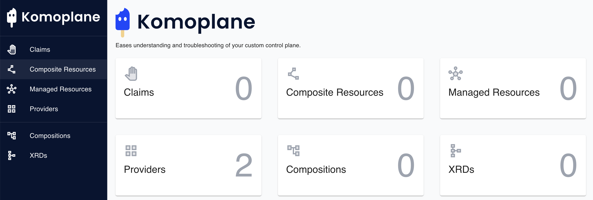

### **Lab 04 Visualization [AWS]: Deploying Komoplane**

Deploy Komoplane to visualize Universal Crossplane

- Definitions
- Compositions
- Claims
- Resources

**Prerequisites:**

- Ensure that you have completed previous labs, or you have a running UXP instance and provider-aws installed on a Kubernetes cluster.

**Steps:**

1. Update helm:

```
$ helm repo add komodorio https://helm-charts.komodor.io && helm repo update komodorio && helm upgrade --install komoplane komodorio/komoplane

"komodorio" already exists with the same configuration, skipping
Hang tight while we grab the latest from your chart repositories...
...Successfully got an update from the "komodorio" chart repository
Update Complete. ⎈Happy Helming!⎈
Release "komoplane" does not exist. Installing it now.
NAME: komoplane
LAST DEPLOYED: Sat Nov  4 08:52:40 2023
NAMESPACE: default
STATUS: deployed
REVISION: 1
NOTES:
Thank you for installing Komoplane.
Application can be accessed:
  * Within your cluster, at the following DNS name at port 8090:

    komoplane.default.svc.cluster.local

  * From outside the cluster, run these commands in the same shell:

    export POD_NAME=$(kubectl get pods --namespace default -l "app.kubernetes.io/name=komoplane,app.kubernetes.io/instance=komoplane" -o jsonpath="{.items[0].metadata.name}")
    export CONTAINER_PORT=$(kubectl get pod --namespace default $POD_NAME -o jsonpath="{.spec.containers[0].ports[0].containerPort}")
    echo "Visit http://127.0.0.1:8090 to use your application"
    kubectl --namespace default port-forward $POD_NAME 8090:$CONTAINER_PORT

Visit our repo at:
https://github.com/komodorio/komoplane
```

2. In a new terminal window export the Komoplane pod and container names:

```
$ export POD_NAME=$(kubectl get pods --namespace default -l "app.kubernetes.io/name=komoplane,app.kubernetes.io/instance=komoplane" -o jsonpath="{.items[0].metadata.name}")

$ export CONTAINER_PORT=$(kubectl get pod --namespace default $POD_NAME -o jsonpath="{.spec.containers[0].ports[0].containerPort}")
```

3. Forward localhost:8090 to Komoplane:

```
$ kubectl --namespace default port-forward $POD_NAME 8090:$CONTAINER_PORT

Forwarding from 127.0.0.1:8090 -> 8090
Forwarding from [::1]:8090 -> 8090
```

4. Visit the Komoplane endpoint:

```
$ open http://127.0.0.1:8090
```




**Lab 04 - Komoplane Complete.**

- Continue to [Lab 05](../../lab05/aws/lab05.md).
