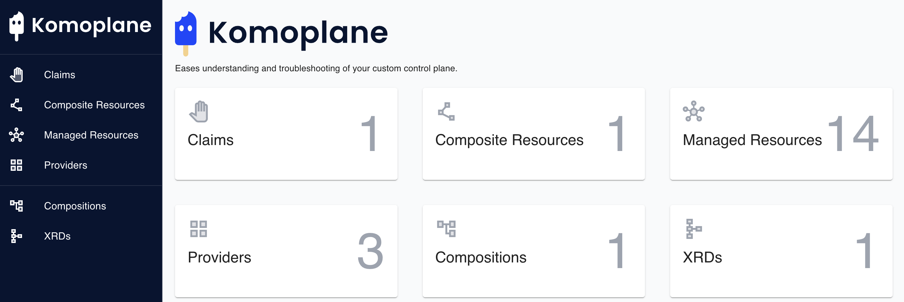

### **Lab 05 [AWS]: Building a Composition**

[Compositions](https://docs.crossplane.io/latest/concepts/compositions/) allow platform builders to define new custom resources that are composed of managed resources. In this lab, we will be building composition for a new type, **_CompositePostgreSQLInstance_** which is composed of a couple of managed resources, namely **_VPC, Subnet, DBSubnetGroup, InternetGateway, RouteTable, SecurityGroup, and RDSInstance._**

**Prerequisites:**

- Ensure that you have completed [Lab 04](../../lab04/aws/lab04.md), or you have a running UXP instance, provider-aws is installed and a default ProviderConfig pointing to AWS credentials secret exists

1. We need to add the RDS CRDs and controller to our cluster. Update your provider-aws-ec2.yaml so that both EC2 and RDS families are installed:

```
$ mv provider-aws-ec2.yaml provider-aws.yaml
$ vi provider-aws.yaml

apiVersion: pkg.crossplane.io/v1
kind: Provider
metadata:
  name: provider-aws-ec2
spec:
  package: xpkg.upbound.io/upbound/provider-aws-ec2:v0.43.1
---
apiVersion: pkg.crossplane.io/v1
kind: Provider
metadata:
  name: provider-aws-rds
spec:
  package: xpkg.upbound.io/upbound/provider-aws-rds:v0.43.1
```

2. Apply the file to your cluster.

```
$ kubectl apply -f provider-aws.yaml

provider.pkg.crossplane.io/provider-aws-ec2 unchanged
provider.pkg.crossplane.io/provider-aws-rds created
```

3. Confirm that both the EC2 and RDS providers are running:

```
$ kubectl get -f provider-aws.yaml

NAME               INSTALLED   HEALTHY   PACKAGE                                            AGE
provider-aws-ec2   True        True      xpkg.upbound.io/upbound/provider-aws-ec2:v0.43.1   70m
provider-aws-rds   True        True      xpkg.upbound.io/upbound/provider-aws-rds:v0.43.0   49s
```

**Steps:**

1. The first step when building compositions is defining a new `Kind` for the Composite Resource. Composite Resources are defined by a **_CompositeResourceDefinition (XRD)._**

   Inspect and create this [CompositeResourceDefinition](https://raw.githubusercontent.com/upbound/uxp-training/main/lab05/configuration/definition.yaml) on the cluster which will:

- Define a **_CompositePostgreSQLInstance_** as a **_CompositeResource (XR)_**
- Offer a **_PostgreSQLInstance claim (XRC)_** for that XR.

```
$ wget -q https://raw.githubusercontent.com/upbound/uxp-training/main/lab05/configuration/definition.yaml
$ kubectl apply -f definition.yaml

compositeresourcedefinition.apiextensions.crossplane.io/compositepostgresqlinstances.database.example.org created
```

2. Check the status of the **_CompositeResourceDefinition_** and verify that it is **_ESTABLISHED_** and **_OFFERED_**:

```
$ kubectl get xrd

NAME                                                ESTABLISHED   OFFERED   AGE
compositepostgresqlinstances.database.example.org   True          True      4m23s
```

3. Verify that the new types are defined on the cluster:

```
$ kubectl get crd | grep postgresqlinstance

compositepostgresqlinstances.database.example.org              2023-11-04T13:25:16Z
postgresqlinstances.database.example.org                       2023-11-04T13:25:16Z
```

4. [Specify how this resource should be composed](https://docs.crossplane.io/latest/concepts/compositions/). This is done by another custom resource called **Composition**

   Inspect and create this [Composition](https://raw.githubusercontent.com/upbound/uxp-training/main/lab05/configuration/composition.yaml) on the cluster:

```
$ wget -q https://raw.githubusercontent.com/upbound/uxp-training/main/lab05/configuration/composition.yaml
$ kubectl apply -f composition.yaml

composition.apiextensions.crossplane.io/vpcpostgresqlinstances.aws.database.example.org created
```

5. Create a Secret for database password

```
$ kubectl -n upbound-system create secret generic getting-started-db-pass --from-literal=password=supersecret

secret/getting-started-db-pass created
```

6. Now we are ready to claim our new Infrastructure resource. Create the following [Composite Resource Claim (XRC)](https://docs.crossplane.io/latest/concepts/claims/) object:

```
$ vi claim.yaml

apiVersion: database.example.org/v1alpha1
kind: PostgreSQLInstance
metadata:
  name: my-db
  namespace: default
spec:
  parameters:
    storageGB: 20
    passwordSecretName: getting-started-db-pass
  compositionSelector:
    matchLabels:
      uxp-guide: getting-started
  writeConnectionSecretToRef:
    name: db-conn

$ kubectl apply -f claim.yaml

postgresqlinstance.database.example.org/my-db created
```

Check Komoplane - you can see resources are being created:



Click around, see what you can do.

7. Check all the managed resources created for this XRC object. “`managed`” is a Kubernetes API category that contains all Crossplane Managed Resources. We use a label selector to select our DB:

```
$ kubectl get managed -l crossplane.io/claim-name=my-db

NAME                                                   READY   SYNCED   EXTERNAL-NAME           AGE
internetgateway.ec2.aws.upbound.io/my-db-q9pm7-r4kzg   True    True     igw-08378de2ff2826b1d   12m

NAME                                              READY   SYNCED   EXTERNAL-NAME           AGE
routetable.ec2.aws.upbound.io/my-db-q9pm7-fs5nc   True    True     rtb-04f43885e1108fb9d   12m

NAME                                         READY   SYNCED   EXTERNAL-NAME                       AGE
route.ec2.aws.upbound.io/my-db-q9pm7-fmwnw   True    True     r-rtb-04f43885e1108fb9d1080289494   12m

NAME                                                         READY   SYNCED   EXTERNAL-NAME                AGE
routetableassociation.ec2.aws.upbound.io/my-db-q9pm7-frjtf   True    True     rtbassoc-0de36a9f92656dcb1   12m
routetableassociation.ec2.aws.upbound.io/my-db-q9pm7-kw22z   True    True     rtbassoc-0014e18de66781e23   12m
routetableassociation.ec2.aws.upbound.io/my-db-q9pm7-swpfj   True    True     rtbassoc-0ecff59744f71580e   12m

NAME                                       READY   SYNCED   EXTERNAL-NAME           AGE
vpc.ec2.aws.upbound.io/my-db-q9pm7-8wbvc   True    True     vpc-0585f0be6fcb259c9   12m

NAME                                          READY   SYNCED   EXTERNAL-NAME              AGE
subnet.ec2.aws.upbound.io/my-db-q9pm7-5fq5q   True    True     subnet-00dc59654431eced9   12m
subnet.ec2.aws.upbound.io/my-db-q9pm7-nc5kb   True    True     subnet-09a88fb51073c9f8c   12m
subnet.ec2.aws.upbound.io/my-db-q9pm7-xkxjh   True    True     subnet-019b659de2c22ce64   12m

NAME                                                 READY   SYNCED   EXTERNAL-NAME          AGE
securitygroup.ec2.aws.upbound.io/my-db-q9pm7-x5988   True    True     sg-0dac59d000460f186   12m

NAME                                                     READY   SYNCED   EXTERNAL-NAME       AGE
securitygrouprule.ec2.aws.upbound.io/my-db-q9pm7-nz6fx   True    True     sgrule-2602486501   12m

NAME                                            READY   SYNCED   EXTERNAL-NAME       AGE
instance.rds.aws.upbound.io/my-db-q9pm7-27l6f   True    True     my-db-q9pm7-27l6f   12m

NAME                                               READY   SYNCED   EXTERNAL-NAME       AGE
subnetgroup.rds.aws.upbound.io/my-db-q9pm7-8fr7t   True    True     my-db-q9pm7-8fr7t   12m
```

8. Check the status of our XRC resource:

```
$ kubectl -n default get postgresqlinstance

NAME    SYNCED   READY   CONNECTION-SECRET   AGE
my-db   True     True    db-conn             13m
```

9. Wait for enough time until all managed resources are **_READY_** and **_SYNCED._** You can check the output of the commands in the previous two steps. In the meantime, you can verify that the resources are actually created on the AWS side by navigating through the AWS console.
10. Eventually (in around 10 mins) you should see our XRC is ready.

```
$ kubectl -n default get postgresqlinstance

NAME    READY   CONNECTION-SECRET   AGE
my-db   True    db-conn             13m
```

and its [connection details](https://github.com/upbound/uxp-training/blob/main/lab05/configuration/composition.yaml#L200-L206) are available in a k8s secret named **_db-conn_**:

```
$ kubectl -n default describe secrets db-conn

Name:         db-conn
Namespace:    default
Labels:       <none>
Annotations:  <none>

Type:  connection.crossplane.io/v1alpha1

Data
====
endpoint:  63 bytes
password:  11 bytes
username:  10 bytes
```

**Cleanup (skip if you are proceeding with Lab 06):**

1. Delete the **_PostgreSQLInstance_** object from cluster:

```
$ kubectl -n default delete PostgreSQLInstance my-db
```

2. Verify that corresponding managed resources are being deleted and eventually disappeared:

```
$ kubectl get managed -l crossplane.io/claim-name=my-db
```

**Lab 05 Complete.**

- Continue to [Lab 06](../../lab06/aws/lab06.md).
