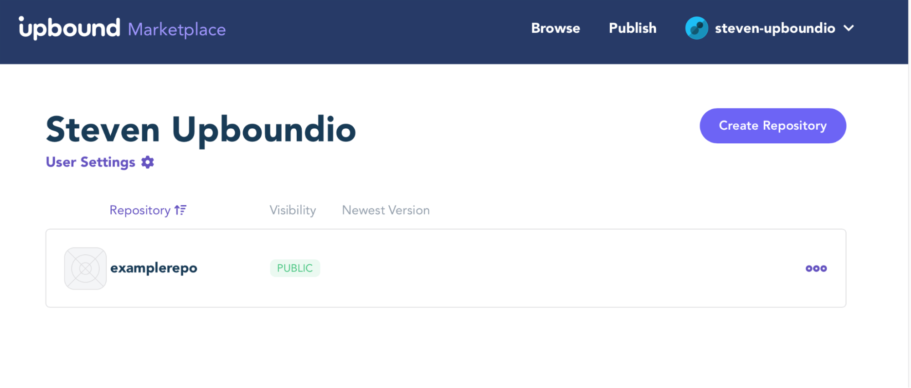
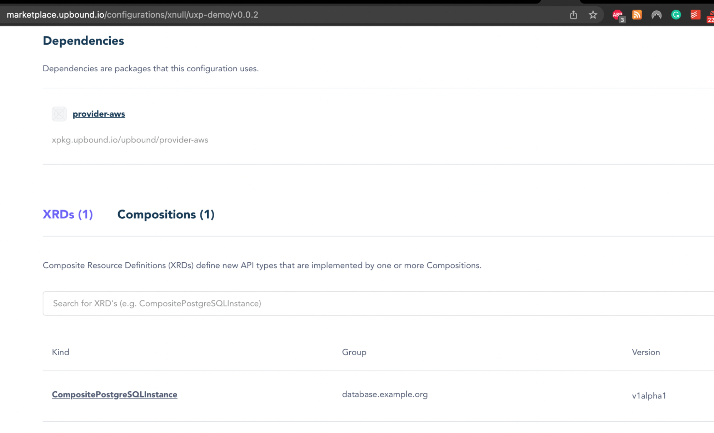

### **Lab 08 [AWS]: Packaging Compositions as a Configuration**

You can package your compositions as Crossplane Configuration Packages. See [Crossplane Packages](https://docs.crossplane.io/latest/concepts/packages/) documentation for more details.

In this lab, we are going to build a configuration package for the composition that we built in the previous lab.

**Prerequisites:**

- Ensure that [Docker](https://www.docker.com/products/docker-desktop) is installed.
- up CLI installed. See [installation instructions](https://docs.upbound.io/cli/).
- An account on [cloud.upbound.io](cloud.upbound.io). If you don’t have an account you can register for free at [https://accounts.upbound.io/register](https://accounts.upbound.io/register)

**Steps:**

1. Create a configuration directory and change directory into it.

```
$ mkdir uxp-config
$ cd uxp-config
```

2. Create **_crossplane.yaml_** which contains the metadata of the configuration package.

```
cat <<EOF > crossplane.yaml
apiVersion: meta.pkg.crossplane.io/v1
kind: Configuration
metadata:
  name: getting-started-with-aws
  annotations:
    uxp-guide: getting-started
    provider: aws
spec:
  crossplane:
    version: ">=v1.12.2"
  dependsOn:
    - provider: xpkg.upbound.io/upbound/provider-aws-ec2
      version: ">=v0.40.0"
    - provider: xpkg.upbound.io/upbound/provider-aws-rds
      version: ">=v0.40.0"
    - provider: xpkg.upbound.io/upbound/provider-aws-iam
      version: ">=v0.40.0"

EOF
```

3. Put your **CompositeResourceDefinitions** and **Compositions** under the same directory:

```
$ wget -q https://raw.githubusercontent.com/upbound/uxp-training/main/lab05/configuration/definition.yaml

$ wget -q https://raw.githubusercontent.com/upbound/uxp-training/main/lab05/configuration/composition.yaml
```

4. Build the Configuration:

```
$ up xpkg build --output=uxp-training.xpkg

xpkg saved to uxp-training.xpkg
```

5. Verify that the Configuration package created under the same directory:

```
$ ls uxp-training.xpkg

uxp-training.xpkg
```

6. Now, we can publish our package to the [Upbound Registry](https://marketplace.upbound.io/) by logging into our Upbound account. Update the information below for your Upbound account and repository and run the commands. Your upbound account is visible on the top right corner.

   Check your username at [https://accounts.upbound.io/settings/profile](https://accounts.upbound.io/settings/profile).

```
# Change `elohmrow` to your Upbound Cloud username  
UBC_ACCOUNT=elohmrow
up login -u ${UBC_ACCOUNT}

Password: 
elohmrow logged in

# Create a repository on Upbound Cloud
UBC_REPO=examplerepo
up repository create ${UBC_REPO}

bda-org/examplerepo created

# Push the getting started package
VERSION_TAG=v0.0.1
up xpkg push ${UBC_ACCOUNT}/${UBC_REPO}:${VERSION_TAG} -f uxp-training.xpkg

xpkg pushed to bda-org/examplerepo:v0.0.1
```

7. Login to the Upbound Cloud console and check your repository and verify that the configuration package is accepted.




8. Now, you can share your configuration with others through the registry.





**Lab 08 Complete.**

- Continue to [Lab 09](../../lab09/aws/lab09.md).
