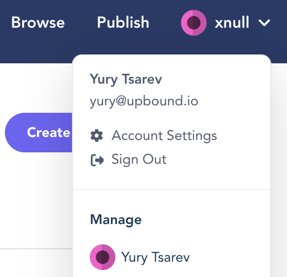

### **Lab 08 [Azure]: Packaging Compositions as a Configuration with Family Providers**

You can package your compositions as Crossplane Configuration Packages. See [Crossplane Packages](https://docs.crossplane.io/latest/concepts/packages/) documentation for more details.

In this lab, we are going to build a configuration package for the composition that we built in the previous lab.

**Prerequisites:**

- Ensure that [Docker](https://www.docker.com/products/docker-desktop) is installed.
- up CLI installed. See [installation instructions](https://docs.upbound.io/cli/).
- An account on [cloud.upbound.io](cloud.upbound.io). If you don’t have an account you can register for free at [https://accounts.upbound.io/register](https://accounts.upbound.io/register)

**Steps:**

1. Create a configuration directory and change directory into it.

```
$ mkdir uxp-config
$ cd uxp-config
```

2. Create **_crossplane.yaml_** which contains the metadata of the configuration package.

```
cat <<EOF > crossplane.yaml
apiVersion: meta.pkg.crossplane.io/v1
kind: Configuration
metadata:
  name: getting-started-with-azure
  annotations:
    uxp-guide: getting-started
    provider: azure
spec:
  crossplane:
    version: ">=v1.12.2"
  dependsOn:
    - provider: xpkg.upbound.io/upbound/provider-family-azure
      version: "v0.37.1"
    - provider: xpkg.upbound.io/upbound/provider-azure-network
      version: "v0.37.1"
    - provider: xpkg.upbound.io/upbound/provider-azure-dbforpostgresql
      version: "v0.37.1"
EOF
```

3. Put your **CompositeResourceDefinitions** and **Compositions** under the same directory:

```
$ wget -q https://raw.githubusercontent.com/upbound/uxp-training/main/lab07-xrd-status/configuration/definition.yaml

$ wget -q https://raw.githubusercontent.com/upbound/uxp-training/main/lab07-xrd-status/configuration/composition-azure.yaml
```

4. Build the Configuration:

```
$ up xpkg build --output=uxp-training.xpkg

xpkg saved to uxp-training.xpkg
```

5. Verify that the Configuration package created under the same directory:

```
$ ls uxp-training.xpkg

uxp-training.xpkg
```

6. Now, we can publish our package to the Upbound Registry. Update information below for your Upbound account and repository and run the commands.

   Check your username at [https://accounts.upbound.io/settings/profile](https://accounts.upbound.io/settings/profile).

```
# Change `elohmrow` to your Upbound Cloud username  
UBC_ACCOUNT=elohmrow
up login -u ${UBC_ACCOUNT}

Password: 
elohmrow logged in

# Create a repository on Upbound Cloud
UBC_REPO=examplerepo
up repository create ${UBC_REPO}

bda-org/examplerepo created

# Push the getting started package
VERSION_TAG=v0.0.1
up xpkg push ${UBC_ACCOUNT}/${UBC_REPO}:${VERSION_TAG} -f uxp-training.xpkg

xpkg pushed to bda-org/examplerepo:v0.0.1
```

7. Login to the Upbound Marketplace, go to your account under Manage or just directly proceed to [https://marketplace.upbound.io/account/${UP_ACCOUNT](https://marketplace.upbound.io/account/${UP_ACCOUNT)} to list your repositories





8. Verify that the configuration package is accepted.


9. Now you can test the standard docker pull

```
$ docker pull xpkg.upbound.io/${UP_ACCOUNT}/${UP_REPO}:${VERSION_TAG}
```

10. Eventually(not in this lab), you can make your package [Public](https://docs.upbound.io/upbound-marketplace/packages/#publishing-public-packages) and it will be available in the Marketplace together with documentation


**Lab 08 Complete.**

- Continue to [Lab 09](../../lab09/aws/lab09.md).
