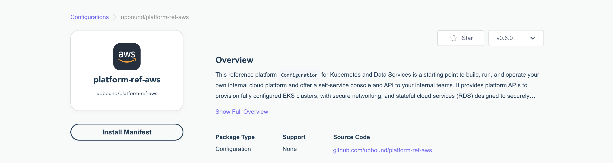

### **Lab 09 [AWS]: Installing a Configuration Package**

Crossplane enables packaging, distributing and sharing infrastructure compositions with Configuration packages.

In this lab, we will install an existing Crossplane configuration, namely [platform-ref-aws](https://github.com/upbound/platform-ref-aws) (on GitHub) or [platform-ref-aws](https://marketplace.upbound.io/configurations/upbound/platform-ref-aws) (on the Upbound Marketplace) and verify the new composite resources are available for use.

**Prerequisites:**

- Ensure that you have completed Lab 02, or you have a running UXP instance.

**Steps:**

1. Go to upbound Marketplace and look at the available Configurations: [https://marketplace.upbound.io/configurations](https://marketplace.upbound.io/configurations)

2. Click on **platform-ref-aws** and then press the Install Manifest button to see the YAML to install this configuration:



3. Create platform-ref-aws.yaml

```
$ vi platform-ref-aws.yaml

apiVersion: pkg.crossplane.io/v1
kind: Configuration
metadata:
  name: platform-ref-aws
spec:
  package: xpkg.upbound.io/upbound/platform-ref-aws:v0.6.0
```

4. Install the Configuration package

```
kubectl apply -f platform-ref-aws.yaml
```

5. Check the installed packages and their statuses:

```
$ kubectl get pkg

NAME                                                          INSTALLED   HEALTHY   PACKAGE                                                    AGE
provider.pkg.crossplane.io/crossplane-contrib-provider-helm   True        True      xpkg.upbound.io/crossplane-contrib/provider-helm:v0.15.0   27s
provider.pkg.crossplane.io/provider-aws-ec2                   True        True      xpkg.upbound.io/upbound/provider-aws-ec2:v0.43.1           3h3m
provider.pkg.crossplane.io/provider-aws-iam                   True        True      xpkg.upbound.io/upbound/provider-aws-iam:v0.43.1           75m
provider.pkg.crossplane.io/provider-aws-rds                   True        True      xpkg.upbound.io/upbound/provider-aws-rds:v0.43.1           141m
provider.pkg.crossplane.io/upbound-provider-aws-eks           True        True      xpkg.upbound.io/upbound/provider-aws-eks:v0.43.1           24s
provider.pkg.crossplane.io/upbound-provider-family-aws        True        True      xpkg.upbound.io/upbound/provider-family-aws:v0.43.1        3h2m

NAME                                               INSTALLED   HEALTHY   PACKAGE                                           AGE
configuration.pkg.crossplane.io/platform-ref-aws   True        True      xpkg.upbound.io/upbound/platform-ref-aws:v0.6.0   31s
```

6. Wait until all installed packages as **_INSTALLED_** and **_HEALTHY_**

```
$ kubectl get pkgrev

NAME                                                                               HEALTHY   REVISION   IMAGE                                                      STATE    DEP-FOUND   DEP-INSTALLED   AGE
providerrevision.pkg.crossplane.io/crossplane-contrib-provider-helm-503c3591121b   True      1          xpkg.upbound.io/crossplane-contrib/provider-helm:v0.15.0   Active                               55s
providerrevision.pkg.crossplane.io/provider-aws-ec2-4805a8dbe18c                   True      1          xpkg.upbound.io/upbound/provider-aws-ec2:v0.43.1           Active   1           1               3h3m
providerrevision.pkg.crossplane.io/provider-aws-iam-086eb2e93217                   True      1          xpkg.upbound.io/upbound/provider-aws-iam:v0.43.1           Active   1           1               75m
providerrevision.pkg.crossplane.io/provider-aws-rds-8355cd8ceaba                   True      1          xpkg.upbound.io/upbound/provider-aws-rds:v0.43.1           Active   1           1               141m
providerrevision.pkg.crossplane.io/upbound-provider-aws-eks-923838545eda           True      1          xpkg.upbound.io/upbound/provider-aws-eks:v0.43.1           Active   1           1               52s
providerrevision.pkg.crossplane.io/upbound-provider-family-aws-a64e2d8b178a        True      1          xpkg.upbound.io/upbound/provider-family-aws:v0.43.1        Active                               3h3m

NAME                                                                    HEALTHY   REVISION   IMAGE                                             STATE    DEP-FOUND   DEP-INSTALLED   AGE
configurationrevision.pkg.crossplane.io/platform-ref-aws-a30ad655c769   True      1          xpkg.upbound.io/upbound/platform-ref-aws:v0.6.0   Active   6           6               59s
```

Notice that some provider packages get installed together with the configuration package since they are listed as [dependencies](https://github.com/upbound/platform-ref-aws/blob/f9d50f9e98c29a40048e271419c95810e3f3dfe8/package/crossplane.yaml#L32) in the configuration meta.

7. Verify that the new Composite Resources types are defined on the cluster:

```
$ kubectl get crds | grep aws.platformref.upbound.io

apps.aws.platformref.upbound.io                                2023-11-04T18:01:47Z
clusters.aws.platformref.upbound.io                            2023-11-04T18:01:48Z
sqlinstances.aws.platformref.upbound.io                        2023-11-04T18:01:47Z
xapps.aws.platformref.upbound.io                               2023-11-04T18:01:47Z
xclusters.aws.platformref.upbound.io                           2023-11-04T18:01:47Z
xeks.aws.platformref.upbound.io                                2023-11-04T18:01:47Z
xnetworks.aws.platformref.upbound.io                           2023-11-04T18:01:47Z
xservices.aws.platformref.upbound.io                           2023-11-04T18:01:47Z
xsqlinstances.aws.platformref.upbound.io                       2023-11-04T18:01:47Z
```

8. You can now start creating these resources after configuring the cloud credentials. If you’re interested in trying out these resources, see the readme [here](https://github.com/upbound/platform-ref-aws).

**Cleanup:**

1. Uninstall the Configuration and Provider Packages:

```
$ kubectl delete -f platform-ref-aws.yaml

configuration.pkg.crossplane.io "platform-ref-aws" deleted
```

**Lab 09 Complete.**
