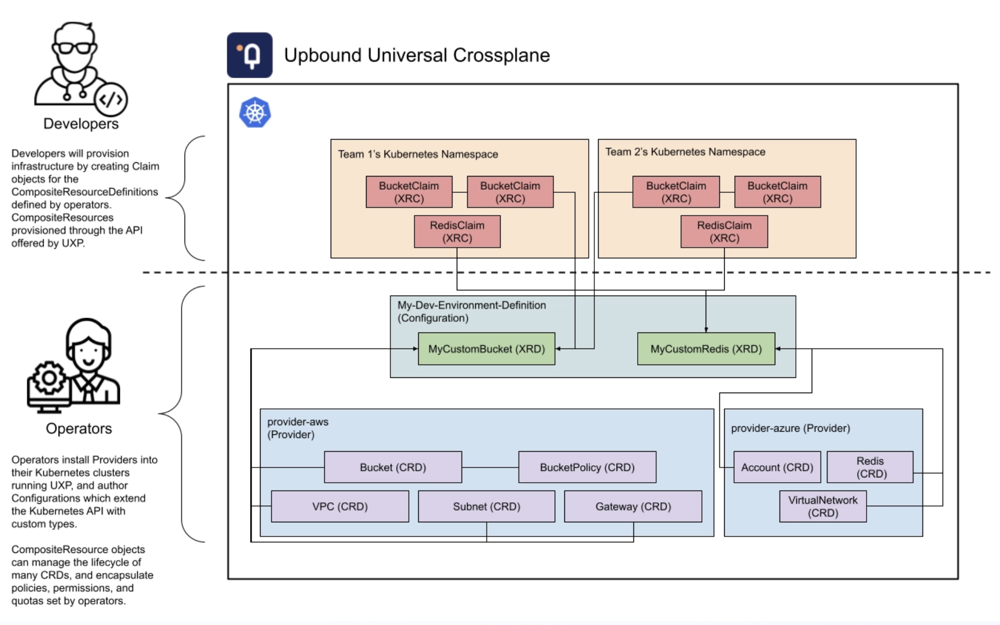
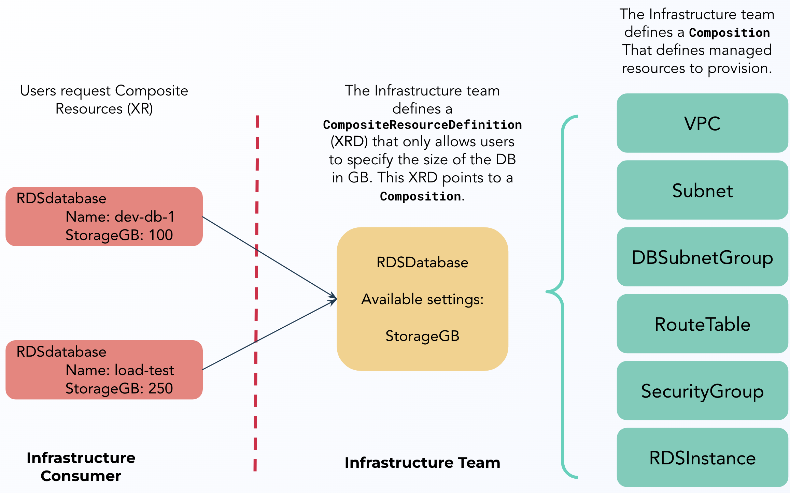
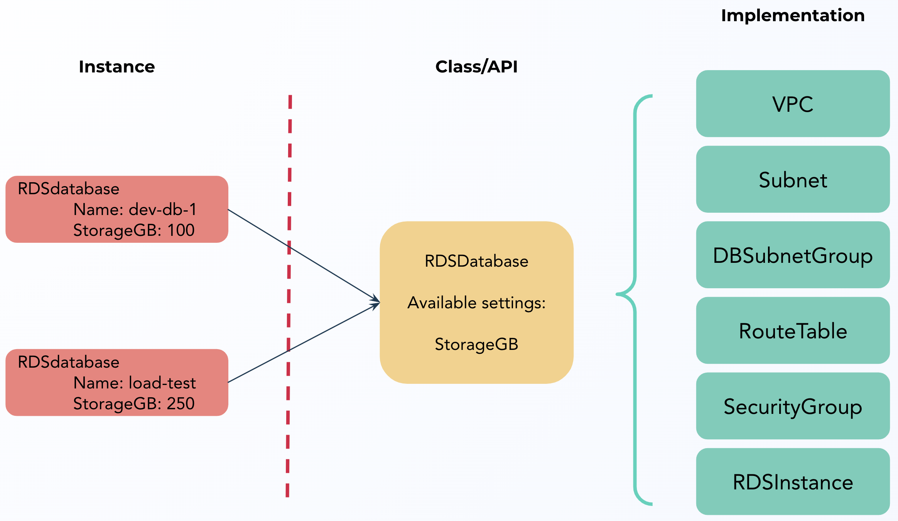
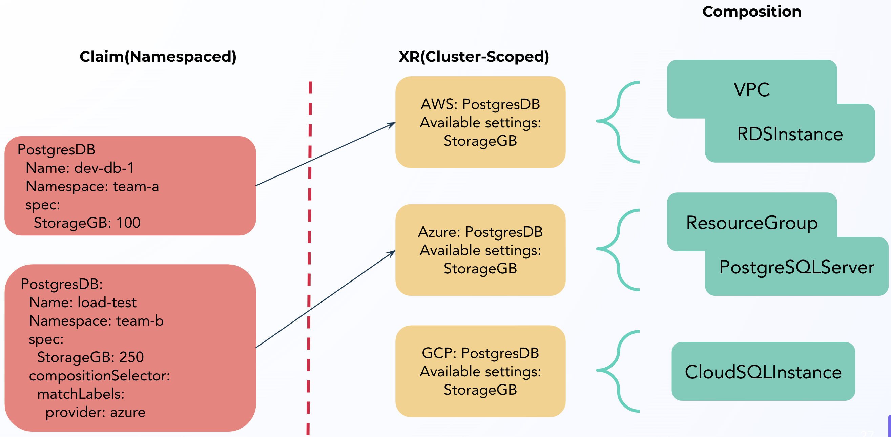
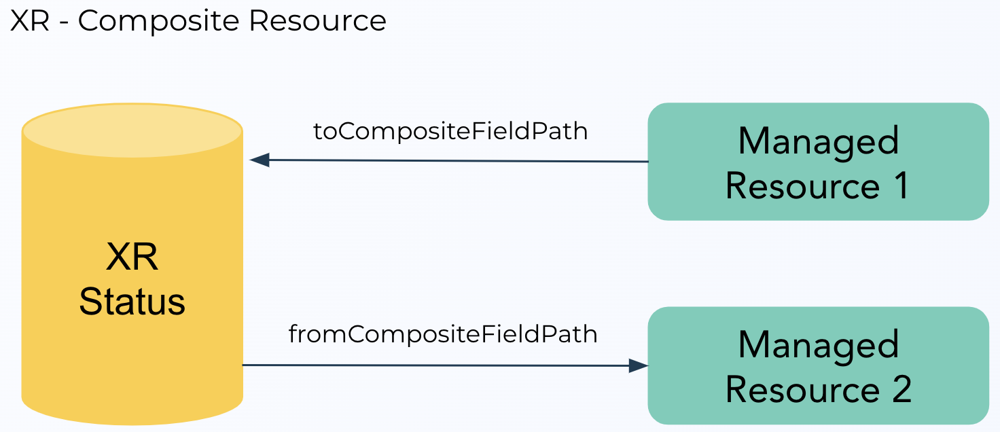

<!-- TODO: fix image sizes -->

<!-- slide 1 -->

# Upbound 

Training Session

Advanced Composition Crafting

---

<!-- slide 2 -->

## Introductions

Tell us:

- A little about yourself!
- Your familiarity with Crossplane
- VI or Emacs? :) 

---

<!-- slide 3 -->

## Instructor

<style>
img {
  width: 110px; 
  height: 110px; 
}
</style>


Yury Tsarev 	
- [email](yury@upbound.io) 
- [LinkedIn](https://www.linkedin.com/in/yurytsarev/) 
- [GitHub](https://github.com/ytsarev) 


Stefano (Steven) Borrelli 	
- [email](steven@upbound.io) 
- [LinkedIn](https://www.linkedin.com/in/stevenborrelli/)
- [GitHub](https://github.com/stevendborrelli)
 
---

<!-- slide 4 -->

## Training Overview

- Level Set and Core Concepts
- Composition Building
- Crossplane Packages
- Best Practices
- Advanced Compositions - Platform Ref Rebuilding from Scratch

---

<!-- slide 5 -->

## Training Guidelines

- It’s OK to Turn off your Camera
- The more interaction, the better!
- We’ll take breaks every 1-1.5 hours.
- For the exercises a Mac, Windows(WSL) or Linux system with access to the internet is required.

---

<!-- slide 6 -->

# Prerequisites for Labs

---

<!-- slide 7 -->

## Prerequisites for the Labs

Before we get into the slides, make sure your system is ready. The next slide will detail what you will initially need.

We’ll be installing UXP onto a Kubernetes cluster and using it to provision resources. In later labs we’ll also install a couple more binaries.

UXP can be installed into almost any Kubernetes environment (a rare exception here is [GKE Autopilot](https://cloud.google.com/kubernetes-engine/docs/concepts/autopilot-overview)).

---

<!-- slide 8 -->

## Prerequisites for the Labs

- A Linux, Mac or Windows(WSL) system
- [Docker](https://www.docker.com/products/docker-desktop) (if using an M1 Mac, make sure to download the right version of Docker).
- [Kubectl](https://kubernetes.io/docs/tasks/tools/#kubectl) binary (minimum v1.24.3, use `kubectl version --client=true`)
- Credentials for AWS that can provision resources. This should include the ACCESS_KEY_ID and SECRET_ACCESS_KEY.
- Kind and UXP are installed.

---

<!-- slide 9 -->

# Level Set

---

<!-- slide 10 -->

## Environment Setup

For the Compositions Training we assume you have completed the following labs. The next four slides

- [Lab 01: Installing a Kind Cluster](lab01/lab01.md)
- [Lab 02: Installing UXP](lab02/lab02.md)
- Lab 03: Installing an Official Provider [AWS](lab03/aws/lab03.md) | [Azure](lab03/azure/lab03.md)
- Lab 04: Deploying a Managed Resource [AWS](lab04/aws/lab04.md) | [Azure](lab04/azure/lab04.md)

---

<!-- slide 11 -->

## LAB 01 + 02 : Installing Kind and UXP

In these labs we’ll install Kind, create a local Kubernetes cluster, and install UXP.

- [Lab 01: Installing a Kind Cluster](lab01/lab01.md)
- [Lab 02: Installing UXP](lab02/lab02.md)

---

<!-- slide 12 -->

## LAB 01 + 02 : Summary

At the end of Labs 01 and 02 we have:
- Installed Kind for local development
- Created a Kind cluster
- Downloaded the “up” CLI
- Installed UXP
- Reviewed what gets deployed when UXP is installed on a cluster

---

<!-- slide 13 -->

## LAB 03: Installing the AWS Provider
## LAB 04: Deploying a Managed Resource

In these labs we’ll install the AWS provider and deploy a Managed resource.

- Lab 03: Installing an Official Provider [AWS](lab03/aws/lab03.md) | [Azure](lab03/azure/lab03.md)
- Lab 04: Deploying a Managed Resource [AWS](lab04/aws/lab04.md) | [Azure](lab04/azure/lab04.md)
---

<!-- slide 14 -->

## LAB 03 + 04 : Summary
At the end of Labs 03 and 04 we have: 
- Deployed the AWS Provider using a Crossplane Package
- Created a Secret using AWS credentials
- Created a ProviderConfig
- Deployed a Managed Resource
- Reviewed the status of the Managed Resource

---

<!-- slide 15 -->

# Composition

---

<!-- slide 16 -->

## Reminder: Managed Resource

Crossplane resources are k8s objects. The resource configuration is set in the specification `forProvider`.

```
apiVersion: rds.aws.upbound.io/v1beta1 
    # ☝️ Crossplane CRDs are full K8s objects and support Versions, Labels and Metadata.
kind: Instance
metadata:
  name: rdspostgresql
spec:
  forProvider:
    # ☝️ Managed Resources provide desired state in the forProvider stanza. The goal is  each Resource is a high-fidelity mapping to the Cloud API.
    instanceClass: db.t2.small
    username: masteruser
    allocatedStorage: 20
    engine: postgres
    engineVersion: "9.6"
    skipFinalSnapshot: true
  writeConnectionSecretToRef:
    # ☝️ If the new resource creates credentials, we can write these back to a K8s Secret.
    namespace: upbound-system
    name: aws-rdspostgresql-conn
```

---

<!-- slide 17 -->

## Limits of Managed Resources

While Managed Resources are very powerful, there are some limitations:

- High-fidelity APIs mean there are a lot of things to configure in each Managed Resource. Could we pre-configure some of the resources?
- In many cloud deployments, multiple Managed Resources are required. Can we combine them into a single Resource?
- In many cases we’d like to abstract the resource. Can users ask for a Database instead of a cloud-provider specific DB?

---

<!-- slide 18 -->

## What is Composition?

- An extension to the Kubernetes Resource Model (KRM)
- A way of composing multiple related Managed Resources together
- A way for Infrastructure Teams to easily define a self-service API that end-users can consume with any tool that supports Kubernetes CRDs.

---

<!-- slide 19 -->

## Composition

[Composition](https://docs.crossplane.io/latest/concepts/compositions/) is a Crossplane feature that allows you to define new Custom Resources from a set of composed Managed Resources.

A Composite Resource Definition (XRD) can be used to combine any number of Kubernetes CRDs to build a service catalog.

---

<!-- slide 20 -->

## Composition: Separation of Control

<style>
img {
  width: 649px; 
  height: 395px; 
}
</style>



---

<!-- slide 21 -->

## Composed Resources

<style>
img {
  width: 649px; 
  height: 395px; 
}
</style>



---

<!-- slide 22 -->

## Composed Resources

<style>
img {
  width: 649px; 
  height: 395px; 
}
</style>



---

<!-- slide 23 -->

## Composition Terms

CompositeResource (XR): This is an infrastructure resource composed of a set of Managed Resources. For example, a CompositeNetwork might include a VPC, Subnets, Gateways and Route Tables.

CompositeResourceDefinition (XRD): this is the API of the Composition. In the XRD definition, infrastructure operators define what spec fields from the underlying Managed Resources are exposed.

Composition: A Composition tells Crossplane how to combine Managed Resources.

---

<!-- slide 24 -->

## Composition Summary So Far...

Using Composition and CompositeResourceDefinitions, we provision a Composed set of Managed Resources and provide an abstract API to end users that limits what they are allowed to configure. 

But what if we wanted to get even more abstract?  What if we wanted to offer users a “Database” that hid the underlying implementation details? 

For example, if a user requests a PostgresSQLInstance that could be provisioned in any of  AWS, Azure or GCP depending on the request. 

---

<!-- slide 25 -->

## Introducing Claims

A Claim is an optional offering on a CompositeResourceDefinition, where a user can request a CompositeResource that may be fulfilled by multiple Compositions.

Claims are also known as XRCs.

Similar to Kubernetes Persistent Volumes (PV) and Persistent Volume Claims (PVC), a Claim can bind to an existing resource or Crossplane can provision a new XR that satisfies the Claim. 

Claims are namespace-scoped, while CompositeResources are cluster-scoped. This allows Infrastructure Operators to isolate tenant infrastructure using Kubernetes namespaces. 

---

<!-- slide 26 -->

## Cluster vs. Namespace Scope

ManagedResources, ProviderConfigs and Composite Resources are all cluster scoped. This means they exist outside of any Kubernetes namespace.

This enables Crossplane to model complex relationships between XRs that may span namespace boundaries - for example MySQLInstances spread across multiple namespaces can all share a VPC that exists above any namespace.

A Claim is a namespaced proxy for a Composite Resource.

---

<!-- slide 27 -->

## Claims

<style>
img {
  width: 649px; 
  height: 395px; 
}
</style>



---

<!-- slide 28 -->

# LAB 05: Building a Composition

---

<!-- slide 29 -->

## LAB 05: Building a Composition

In this lab we’ll install a Composition, an XRD, and request a Claim.

- LAB 05: Building a Composition [AWS](lab05/aws/lab05.md) | [Azure](lab05/azure/lab05.md)

---

<!-- slide 30 -->

## LAB 05: Summary

At the end of Lab 05 we:
- Deployed a `CompositeResourceDefinition` to a cluster
- Deployed a `Composition` to a cluster
- Created a Database `Claim`

---

<!-- slide 31 -->

## Selecting a Composition

When multiple compositions can satisfy a Claim, how to choose one?

First, there is a defaultCompositionRef in the XR.

In addition, you can use a compositionSelector:

```
compositionSelector:
   matchLabels:
     connectivity: private
```

This could be used, for example, to determine whether a GCP CloudSQLInstance or an Azure SQLServer based composition satisfies this PostgresSQLDB instance.

---

<!-- slide 32 -->

## XRD Reference

[Composite Resource Definition](https://docs.crossplane.io/latest/concepts/composite-resource-definitions/) 

Key Topics:
- Connection Secret Keys: what secrets can be returned from the Composition
- Claim Definition: define optional claim
- Default Composition Reference: defaults to using this Composition
- OpenAPIv3 Specification

---

<!-- slide 33 -->

## Composition Reference

[Composition](https://docs.crossplane.io/latest/concepts/compositions/)

Key Topics:
- compositeTypeRef: what XRD contract does this Composition satisfy?
- Resources: A list of Managed Resources that are Composed
- Connection Details: how to return Credentials from a Managed Resource to the XR.
- Patches!

---

<!-- slide 34 -->

## Patching Compositions

[Patches](https://docs.crossplane.io/latest/concepts/patch-and-transform/)

- PatchSets
- The default Patch Type is FromCompositeFieldPath
- Transforms
  - Maps

---

<!-- slide 35 -->

# LAB 06: Extending a Composition

---

<!-- slide 36 -->

## LAB 06: Extending a Composition

In these labs we will extend the XRD and Composition for Lab 05 with additional automatically validated field and implement transform patch.

- LAB 06: Extending a Composition [AWS](lab06/aws/lab06.md) | [Azure](lab06/azure/lab06.md)

---

<!-- slide 37 -->

## LAB 06: Summary

At the end of Lab06 we:
- Extended the XRD with the new field and validation
- Extended the Composition with patch logic of transform map
- Abstracted away specific cloud provider implementation details: we as a platform builders decide what means class “small”, “medium” or “large”. We can also change the underlying instance classes while keeping stable our custom platform API contract.

---

<!-- slide 38 -->

## Patching through the XR Status

A frequent use case is to exchange the data between MRs within the Composition. We can achieve this by publishing a
field from the source MR to a custom XR status field. The data from this status field is consumed by the target MR.

Example:
- [Publish]() <!-- TODO: broken link -->
- [Consume]() <!-- TODO: broken link -->

<style>
img {
  width: 350px; 
  height: 197px; 
}
</style>



---

<!-- slide 39 -->

# LAB 07: XRD Status Patching

---

<!-- slide 40 -->

## LAB 07: XRD Status Patching 

In these labs we will propagate composed RDS Instance status up to Composite Resource (XR) status and afterwards consume this data for IAM Policy creation.

- LAB 07: XR Status Patching [AWS](lab07/aws/lab07.md) | [Azure](lab07/azure/lab07.md) 

---

<!-- slide 41 -->

## LAB 07: Summary

At the end of Lab07 we:
- Extended the XRD with the new status field
- Extended the Composition with ToCompositeFieldPath patch type to publish RDS Instance status to XR status
- Extended the Composition with IAM Policy which embeds XR status data to compose the policy spec.
- Effectively we demonstrated the case of sharing the data between Managed Resources through the Composite Resource Status

---

<!-- slide 42 -->

## Reference Platforms

- Upbound created a set of reference platforms which can be used for bootstrapping
  - [platform references](https://github.com/upbound/?q=platform-ref&type=all&language=&sort=)
  - Or, on the [Marketplace](https://marketplace.upbound.io/configurations)

- Our friends from AWS created a collection of AWS-focused Crossplane Composition + Claims
  - [AWS samples](https://github.com/aws-samples/crossplane-aws-blueprints)

---

<!-- slide 43 -->

# Crossplane Packages

---

<!-- slide 44 -->

## Packages

Crossplane packages are opinionated OCI images that contain a stream of YAML that can be parsed by the Crossplane package manager. Crossplane packages come in two varieties: Providers and Configurations.

Provider Packages install a Crossplane Provider and CRDs.

Configuration Packages install XRDs, Compositions, and can include dependencies on Provider Packages. (for example, a Configuration can depend on provider-azure)

---

<!-- slide 45 -->

## Provider Packages

The Provider Package manifest describes how to run the Provider controller on the cluster:

```
apiVersion: meta.pkg.crossplane.io/v1
kind: Provider
metadata:
  name: provider-aws
spec:
  crossplane:
    version: ">=v1.12.1"
  dependsOn:
    - provider: "xpkg.upbound.io/upbound/provider-family-aws"
      version: "v0.38.0"

```

---

<!-- slide 46 -->

## Configuration Packages

The Configuration Package manifest is mainly concerned with dependencies:
- Supported Versions of Crossplane
- Other Configurations
- Providers

```
apiVersion: meta.pkg.crossplane.io/v1
kind: Configuration
metadata:
  name: my-org-infra
spec:
  crossplane:
    version: ">=v1.12.1"
  dependsOn:
    - provider: "xpkg.upbound.io/upbound/provider-aws-ec2"
      version: ">=v0.38.0"

```

---

<!-- slide 47 -->

## Building Packages

Packages can be built and pushed to an OCI registry using the kubectl crossplane plugin, or via the up CLI using up xpkg. A configuration Package will bundle all the YAML resources in the directory unless the `--ignore` flag is used (see [up xpkg](https://github.com/upbound/up/blob/main/docs/commands.md#xpkg) - learn more about up [here](https://docs.upbound.io/cli/)) .

See [pushing a package](https://docs.crossplane.io/master/concepts/packages/#pushing-a-package) (Crossplane docs) or [Creating an Pushing Packages](https://docs.upbound.io/upbound-marketplace/packages/) (Upbound docs) for more information.

We’ll cover building and pushing Packages in Lab 08.

---

<!-- slide 48 -->

## Installing Packages

Packages can be installed using the kubectl crossplane plugin, or installed by creating Configuration and Package resources on a Kubernetes cluster.

See [installing a package](https://docs.crossplane.io/master/concepts/packages/#installing-a-package) (Crossplane docs) or [Creating an Pushing Packages](https://docs.upbound.io/upbound-marketplace/packages/) (Upbound docs) for more information.


We’ll cover installing a Configuration package in Lab 09.

---

<!-- slide 49 -->

# Lab 08: Packaging Compositions
# Lab 09: Installing a Configuration Package

---

<!-- slide 50 -->

## LAB 08: Packaging Compositions 
## LAB 09: Installing a Configuration Package

In these labs we’ll build, push, and install a Configuration Package.
- LAB 08: Packaging Compositions as a Configuration [AWS](lab08/aws/lab08.md) | [Azure](lab08/azure/lab08.md)
- LAB 09: Installing a Configuration Package [AWS](lab09/aws/lab09.md) | [Azure](lab09/aws/lab09.md)

---

<!-- slide 51 -->

## LAB 08 + 09 : Summary

At the end of Labs 08 and 09 we have:
- Built a Configuration Package with a XRD and Composition
- Pushed the Package to an Upbound Registry
- Installed, Reviewed, and Deleted a Configuration Package 
